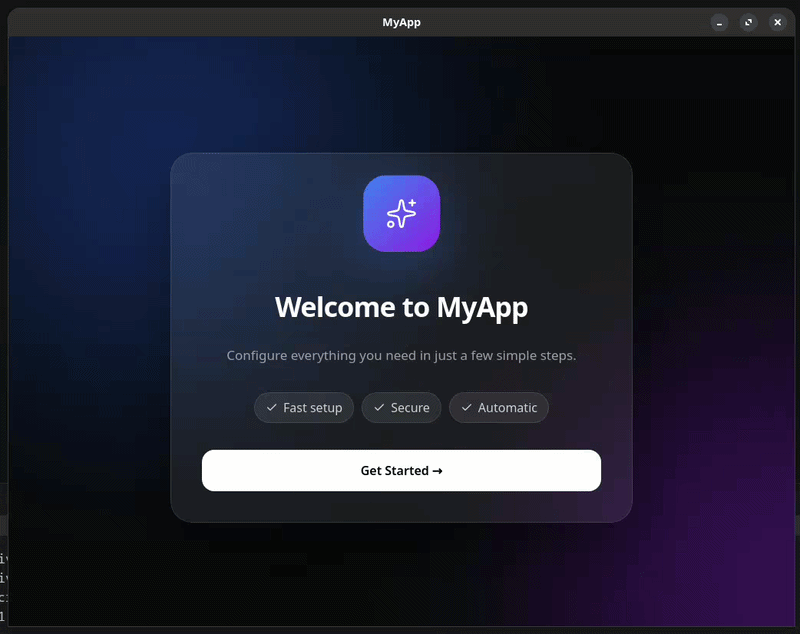

# Simple wails app wizard example

this example if work related to a heavy client installer writen in go.

<video src="./doc/image/demo.mp4" controls width="100%">
  Your browser does not support the video tag.
</video>

